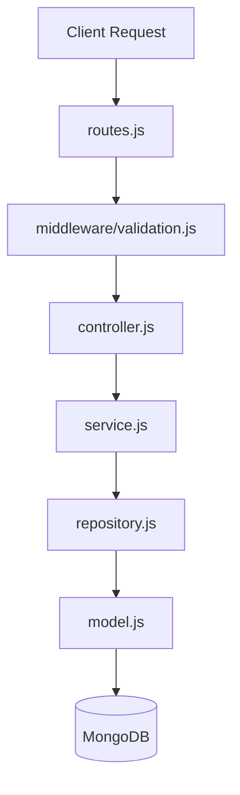

# Modules Layer

## Architecture Pattern
Each folder inside this directory represents a dedicated **business domain/module** (e.g., `auth`, `users`, `organizations`, `projects`, `tasks`). 

To preserve extreme clean separation, maintain high scalability, and avoid spaghetti code, every module **MUST** adhere to the following architecture pattern:

### Component Roles & Responsibilities

1. **`routes.js`**
   * **Responsibility**: Declares paths, endpoints, and verbs (GET, POST, etc.) for the domain.
   * **Rule**: Directly mounts validation schema middleware and auth/RBAC filters, then routes directly to thin controller handlers.

2. **`controller.js` (Keep Thin)**
   * **Responsibility**: Acts strictly as the boundary controller between Express HTTP layer and the core business logic. Extracts headers, parameters (`req.params`, `req.query`, `req.body`), passes them to the service layer, and prepares standardized JSON responses.
   * **Rule**: **NO business logic allowed in controllers**. No direct DB queries. No Mongoose updates. Use `asyncHandler` wrapper on all methods.

3. **`service.js` (Business Layer)**
   * **Responsibility**: Houses all business requirements, transaction validations, data transforms, and complex orchestration.
   * **Rule**: Services are transport-agnostic (have no knowledge of Express, HTTP, `req`, or `res` objects). They can be reused in queues, CRON tasks, or sockets.

4. **`repository.js` (Repository Pattern)**
   * **Responsibility**: Isolates data persistence layers. Operates directly on the database models.
   * **Rule**: Only repositories can access Mongoose models. Every query logic, write execution, indexing helper, aggregation pipeline, or multi-tenant database filter belongs strictly here.

5. **`model.js`**
   * **Responsibility**: Declares the Mongoose Schema, fields, indexes, and schemas validations.
   * **Rule**: Explicitly defines database indexing for quick reads and always respects multi-tenant boundaries (e.g., `organizationId` matching).
